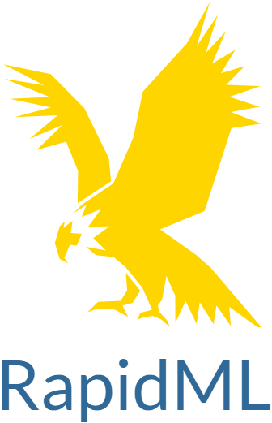

# ASD_Detect
This Android App is used to demonstrate RapidML's use cases. It was created using the [RapidML](https://github.com/ritabratamaiti/RapidML) Python library for web API creation, and [Thunkable](https://thunkable.com/#/) for android app creation.

 

  | <!-- .element height="50%" width="50%" --> 
------------- | --- 

# How to use:
1. Download the APK (ASD_Detection_Application.apk) file on you computer
2. Transfer the APK to your Android device
3. Navigate to the directory where the APK file was transferred to, but on your Android device.
4. Click on the APK file. Now, if you haven't installed a file from external sources before, you may have to turn on your device's developer mode
5. After this, the APK file will install.

6. Open the app, and then fill in the required questionnaire fields.

7. The app will then use RapidML's cloud machine learning to perform a prediction and produce a test diagnosis.

*Note that this application is used only for showcasing RapidML's potential and is **not to be used in any manner for real medical diagnosis. For actual ASD (Autism Spectrum Disorder) diagnosis, consult a medical professional.**

# Autism detection API
Hi!

I am Ritabrata Maiti, the creator of the Autism Detection API. [Find me on LinkedIn here](https://www.linkedin.com/in/ritabratamaiti/)

This project uses the pythonanywhere hosting service to host the API, and run the machine learning model in the cloud. The free tier allows you to host only one web-app (such as a python API), at any given time. However, upto 20 web-apps (APIs) can be hosted by upgrading to the paid tiers. If you consider upgradation, follow this link: https://www.pythonanywhere.com/?affiliate_id=003915da 
Do note that this is an affiliate link =)

Note: ASD refers to Autism Spectrum Disorder

## Application Demo:
Using the same API, I have built an android application which serves as an user friendly tool that can be used by caretakers, doctors and patients to determine an ASD case. [The application, as well as the Thunkable source (.aia) file can be found here](https://github.com/ritabratamaiti/Autism-Detection-API/tree/master/Android%20App%20Based%20on%20API).

Note: This app was built on [Thunkable](https://thunkable.com/); due to the Hybrid nature of the app, the google form in the initial screen may load slowly(because of embedded webviewer). Your patience is appreciated ^_^

## This project has 3 goals:
1. To find out the best machine learning pipeline for predicting ASD cases using genetic algorithms, via the RapidML library. (Classification Problem)
2. Compare the accuracy of the accuracy of the determined pipeline, with a standard Naive-Bayes classifier.
3. Saving the classifier as an external file, and use this file in a Flask API to make predictions in the cloud.

The first 2 goals are achieved via the [Builder_Script.py](Builder_Script.py), which cleans the datasets, performs label encoding and finds the best-fitted classifier pipeline using genetic algorithms from the TPOT library. Furthermore, the builder script produces the files d, df, clf,dt and f. 
* d: This file contains the pickled dictionary used to label-encode the database.
* df: The file contains the pickled skeletal dictionary of the original database.
* clf: This file contains the pickled classifier pipeline that has the highest accuracy, determined via genetic algorithms.
* f: This file contains a dummy row, as initial input that is later utilized by the API script.
* dt: This is an array storing the data-types of the DataFrame coloumns.

The final goal, implementing the flask API, is achieved by the [helper](ASDapi/helper.py) and [API](ASDapi/API.py) scripts. The helper script reads the files created by the builder and uses the saved models to predict an output, from the input obtained from the API request. The API script handles the actual requests and calls the helper script to predict and return an output.

## In order to build the project on your own, you require:
* [The RapidML library](https://github.com/ritabratamaiti/RapidML)
* [A Python 3.6 installation](https://www.python.org/downloads/)
* [The latest scikit learn installation](http://scikit-learn.org/stable/install.html)
* [The latest TPOT installation](https://epistasislab.github.io/tpot/installing/)
* [The latest Flask installation](http://flask.pocoo.org/docs/1.0/installation/#)
* [The dill Python library](https://pypi.org/project/dill/#description)

In order to deploy our flask app to the cloud, we use a service called pythonanywhere. At its free tier, it allows one python web app per account. For hosting upto 20 Python web apps or APIs, upgrade your acount here: https://www.pythonanywhere.com/?affiliate_id=003915da

In the files-tab create a new directory, and upload the files d, df, clf, f as well as the API and the helper scripts. Then create a new web application in the web apps tab and create a new virtualenv as well, and link it to the web app. My instructions are compact, and I highly recommend you check this [official guide](https://help.pythonanywhere.com/pages/Flask/) 

### Note: Before you deploy your web app, go to the directory: /home/"username"/.virtualenvs/"virtualenvname"/bin and delete the file: no-global-site-packages.txt 

*This allows the web app to use external libraries outside the vitualenv, and proceeding without the above modifications causes a glitch/error.*

